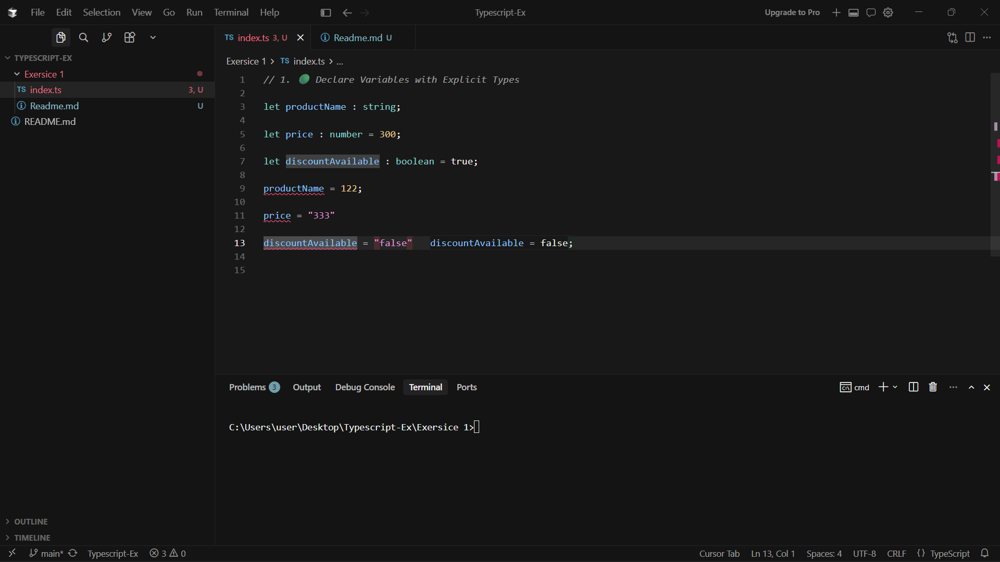
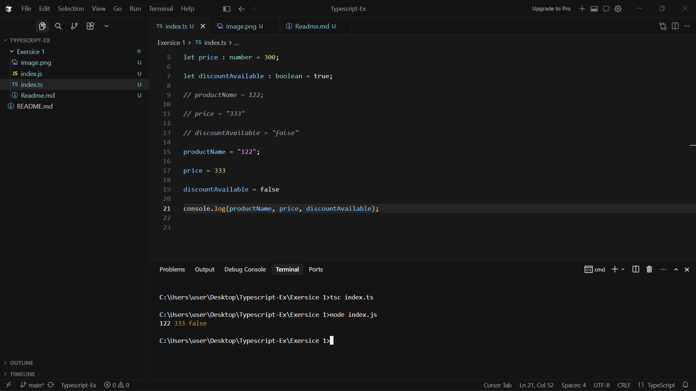
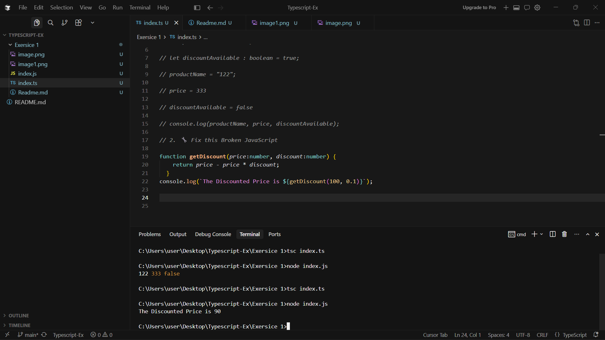
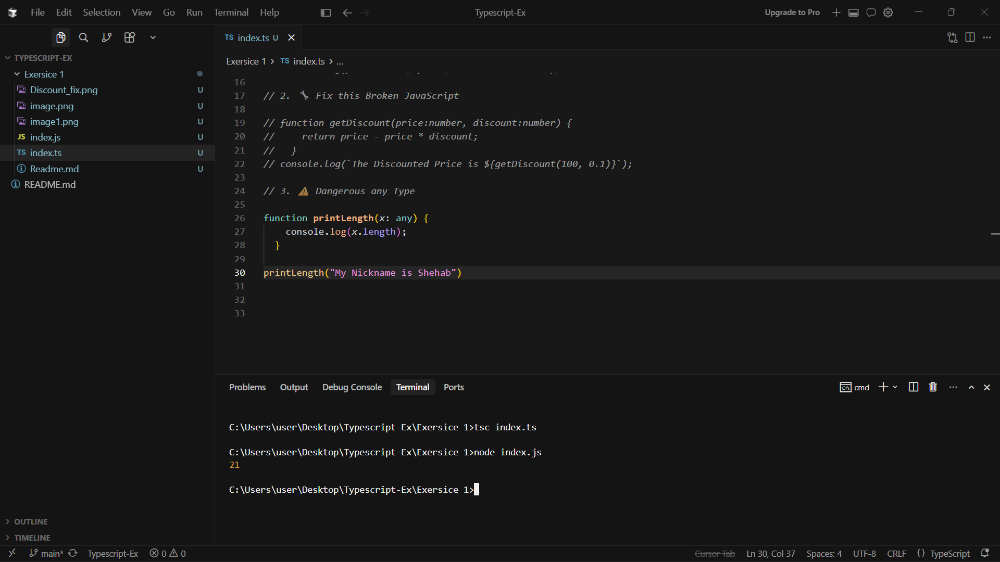
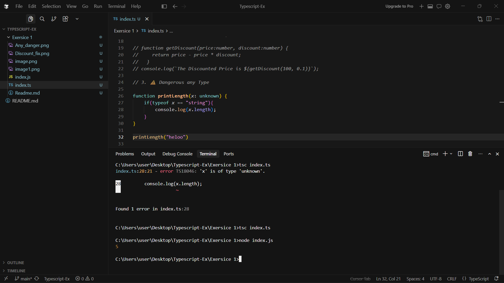

## 🏋️‍♂️ **Student Exercises**

### 1. 🟢 Declare Variables with Explicit Types

Declare the following variables:

- A `productName` of type `string`
- A `price` of type `number`
- A `discountAvailable` of type `boolean`

Then try assigning a wrong value to each and fix the error.





---

### 2. 🔧 Fix this Broken JavaScript

Convert this JS function to TypeScript and add types:

```jsx
function getDiscount(price, discount) {
  return price - price * discount;
}

```

Make sure:

- Both parameters are `number`
- The return value is also a `number`



---

### 3. ⚠️ Dangerous `any`

Here’s a risky TypeScript function using `any`:

```jsx
function printLength(x: any) {
  console.log(x.length);
}

```

Call it with:

- `"Hello"` (should work)
- `123` (should crash)



✅ Replace `any` with a safer approach and prevent the crash.


