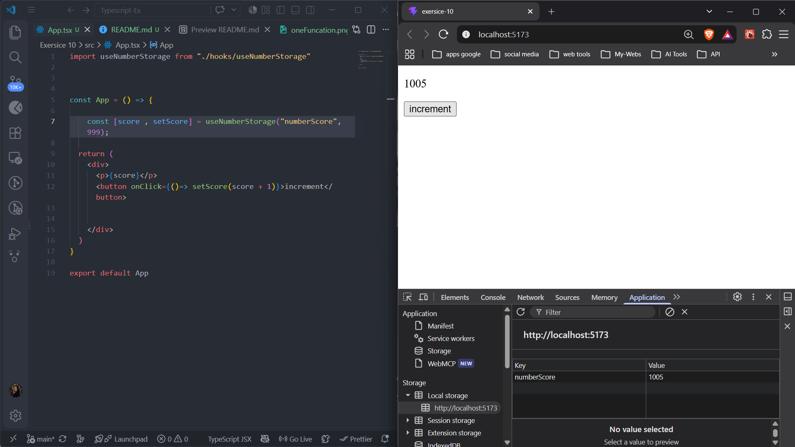
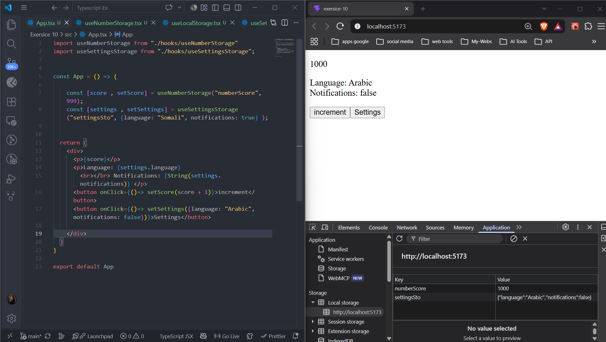
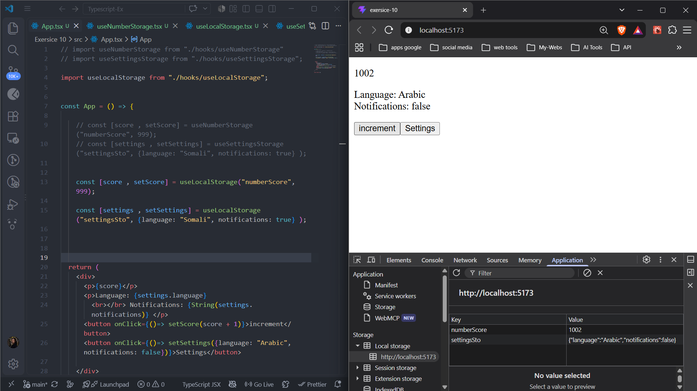

## 🏋️‍♂️ Student Exercises

### 1. Create `useNumberStorage`

Write a custom hook that stores a number in localStorage.

Return a tuple `[number, (val: number) => void]`.



### 2. Create `useSettingsStorage`

Write a hook that saves an object like this:

```
{ language: string; notifications: boolean }

```

Return the object and a setter.



### 3. Convert to Generic

Take your hook from #2 and make it generic like `useLocalStorage<T>`.

