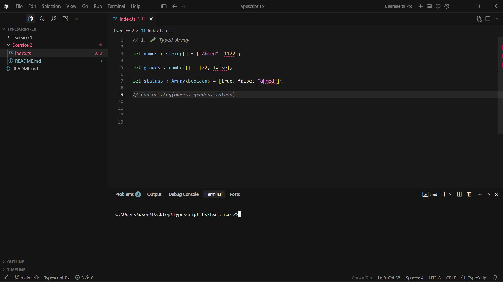
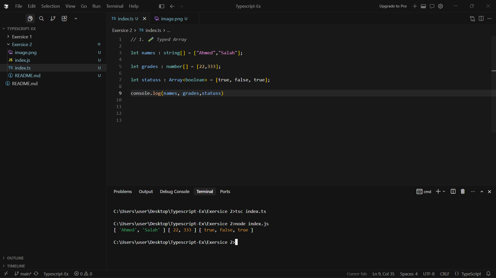
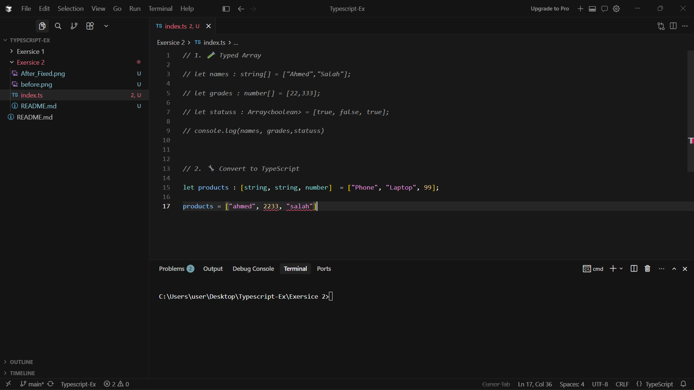
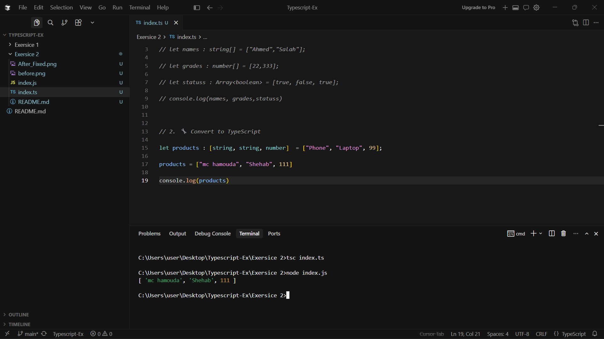
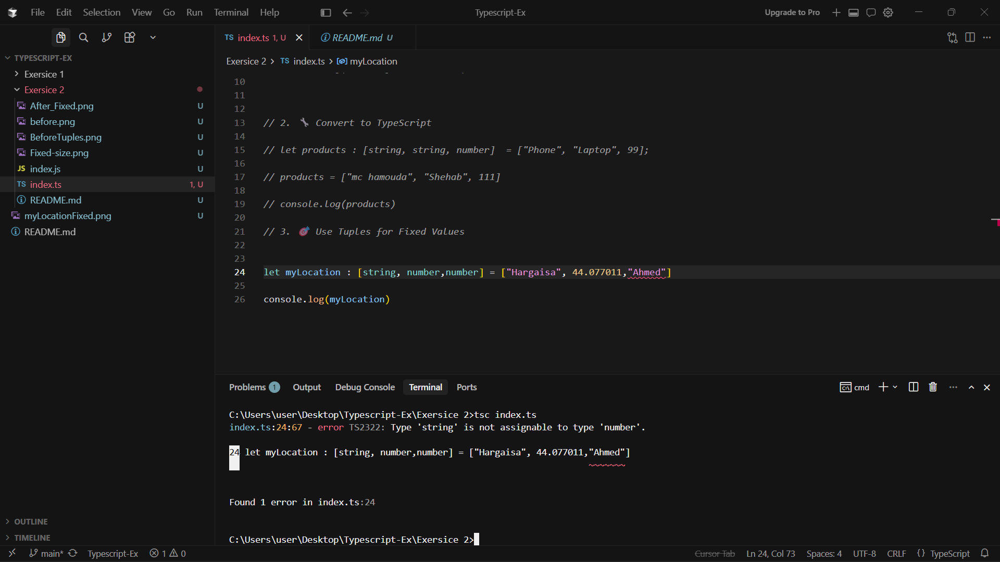
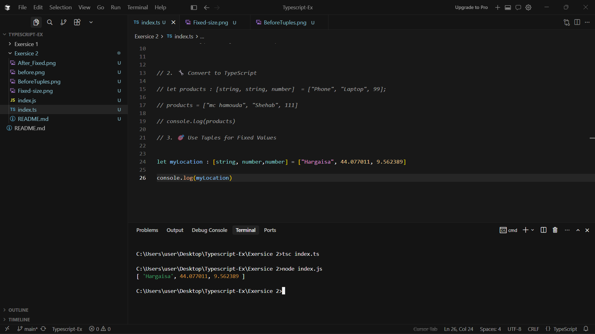

## 🏋️‍♂️ **Student Exercises**

### 1. 🧪 Typed Array

Declare the following variables:

- `names`: an array of strings
- `grades`: an array of numbers
- `status`: an array of booleans

Then try pushing the wrong types and observe the error.





---

### 2. 🔧 Convert to TypeScript

Convert this JavaScript:

```jsx
let products = ["Phone", "Laptop", 99];

```

✅ Rewrite it so:

- `products` can only hold strings
- Any non-string value gives a compile error





---

### 3. 🎯 Use Tuples for Fixed Values

Create a tuple named `location`:

- First item: city name (`string`)
- Second item: latitude (`number`)
- Third item: longitude (`number`)

✅ Test with correct and incorrect orders.




