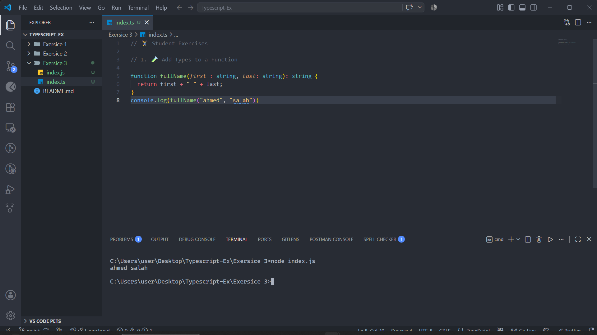
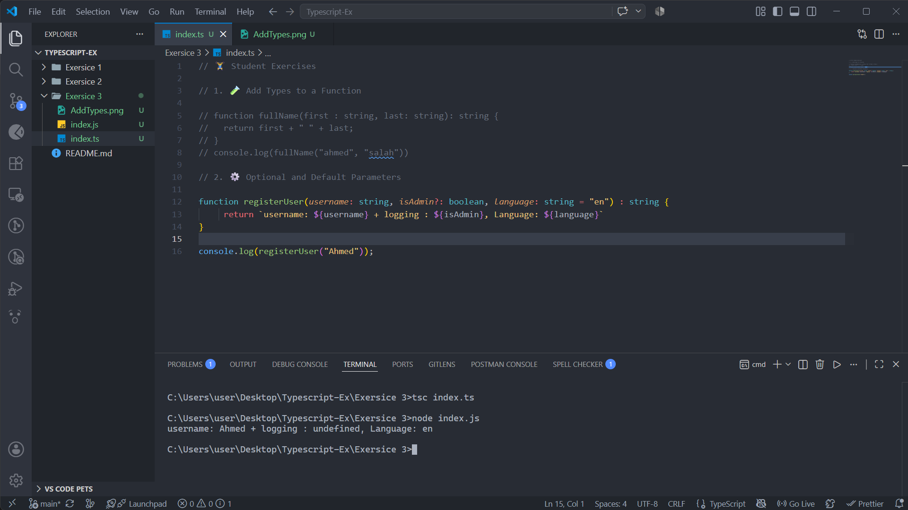
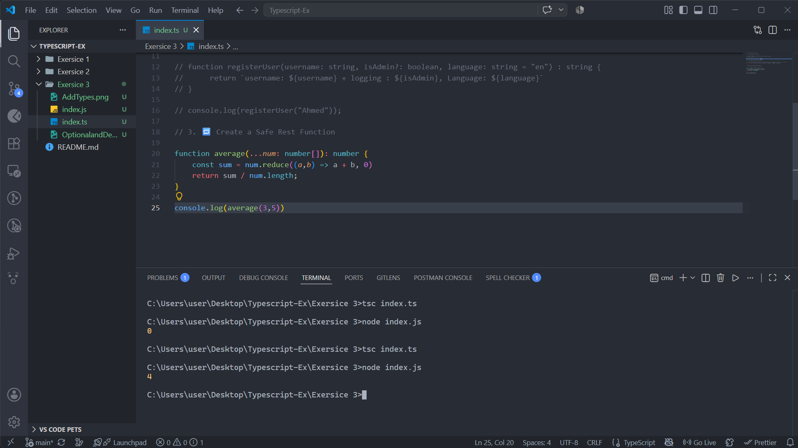

## 🏋️‍♂️ **Student Exercises**

### 1. 🧪 Add Types to a Function

Convert this to TypeScript:

```tsx
function fullName(first, last) {
  return first + " " + last;
}

```

✅ Requirements:

- Both inputs are `string`
- Output is also `string`



---

### 2. ⚙️ Optional and Default Parameters

Write a function `registerUser` that takes:

- `username: string`
- `isAdmin?: boolean`
- `language: string = "en"`

✅ Log the user’s data inside the function.



---

### 3. 🔁 Create a Safe Rest Function

Write a function `average(...scores: number[]): number` that:

- Accepts any number of scores
- Returns their average

✅ Test with 3–5 values.


