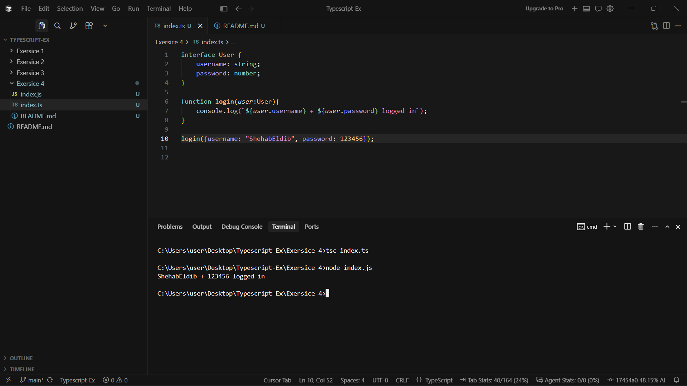
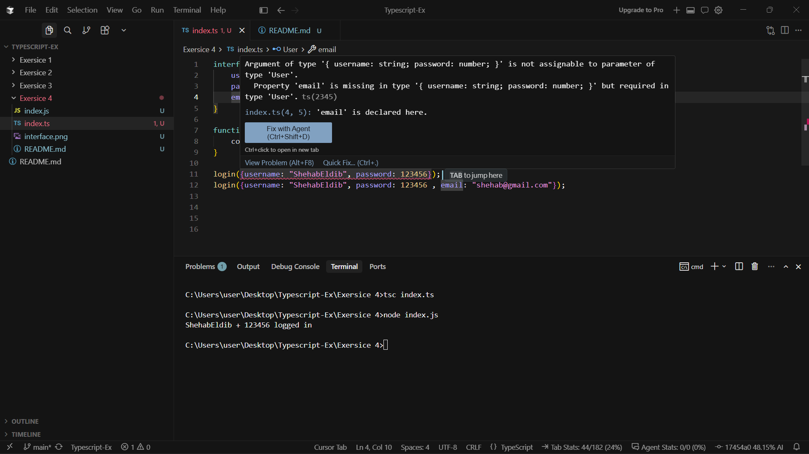
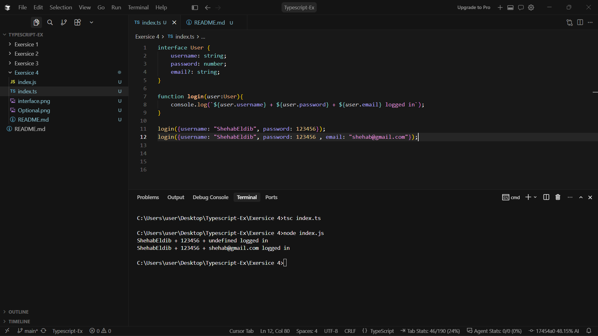
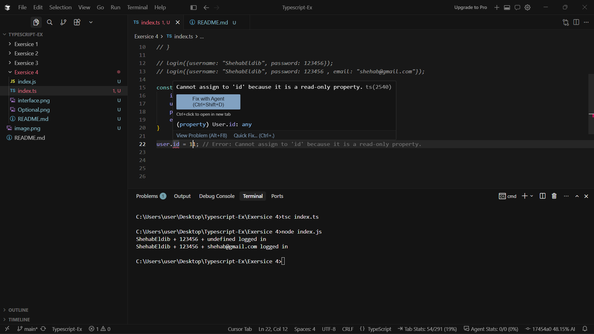

## 🏋️‍♂️ Student Exercises

### 1. 🔧 Define and Use an Interface

Create an interface `User` with:

- `username: string`
- `password: string`

Then write a function `login(user: User): void` and call it with a valid object.



---

### 2. ❓ Use Optional Properties

Extend `User` with:

- `email?: string`

Call `login()` with and without the email.





---

### 3. 🔐 Readonly in Action

Add `readonly id: number` to `User`

Create a user object and try to reassign `id` — see what TypeScript says.


