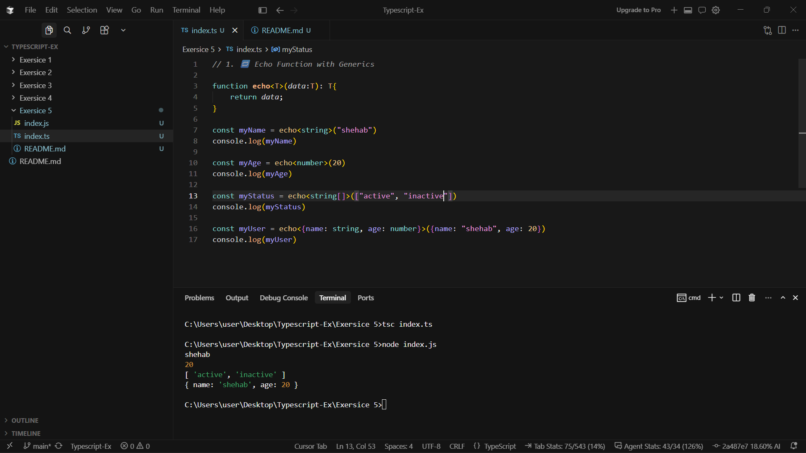
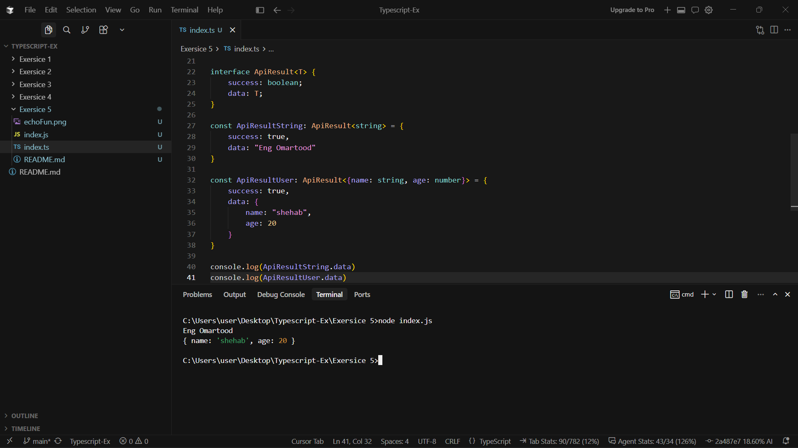
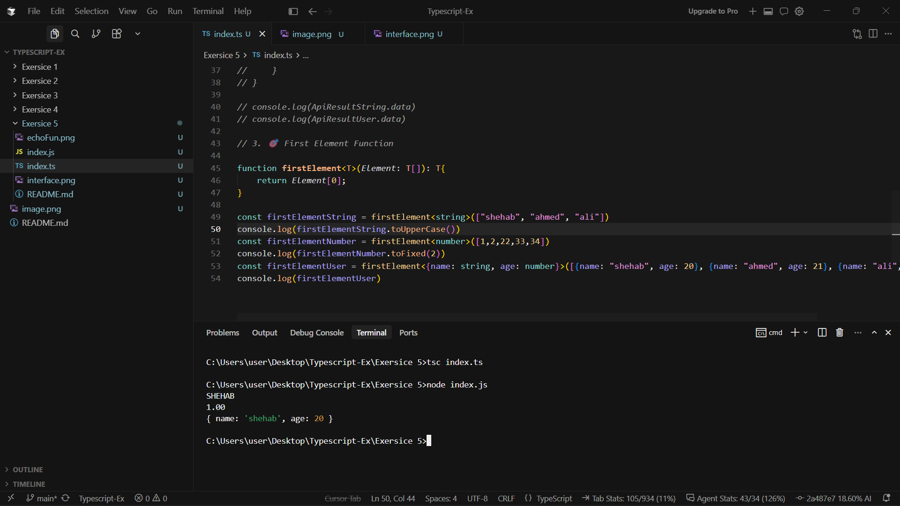

## 🏋️‍♂️ **Student Exercises**

### 1. 🔁 Echo Function with Generics

Write a function `echo<T>(input: T): T`

- Call it with a string, number, array, and object
- Make sure TypeScript gives you correct autocomplete

---

### 2. 📦 Generic Interface

Define an interface `ApiResult<T>` with:

- `status: string`
- `data: T`

Use it for:

- `ApiResult<string>`
- `ApiResult<{ id: number; name: string }>`

---

### 3. 🎯 First Element Function

Create a generic function `first<T>(items: T[]): T`

Call it with:

- An array of numbers
- An array of strings
- An array of objects

