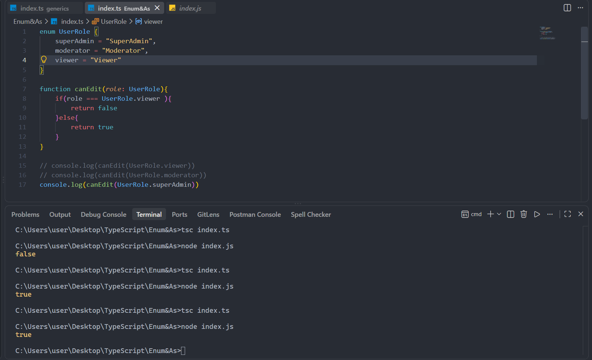
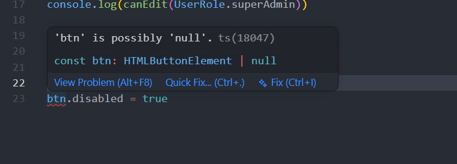
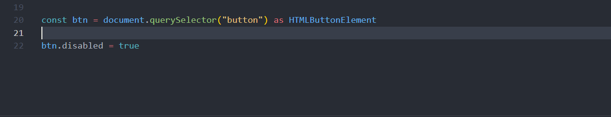

## 🏋️‍♂️ **Student Exercises**

### 1. 🔐 `UserRole` Enum Usage

- Create an `enum` called `UserRole` with the values:

    

    

- Create a function `canEdit(role: UserRole)` that returns `false` only for `"viewer"`

- Call the function with each role

---

### 2. 🖱 Type Assertion with `as`

- Select a `<button>` from the DOM using `document.querySelector`

- Set its `disabled` property to `true`

- Fix the TypeScript error using `as HTMLButtonElement`

