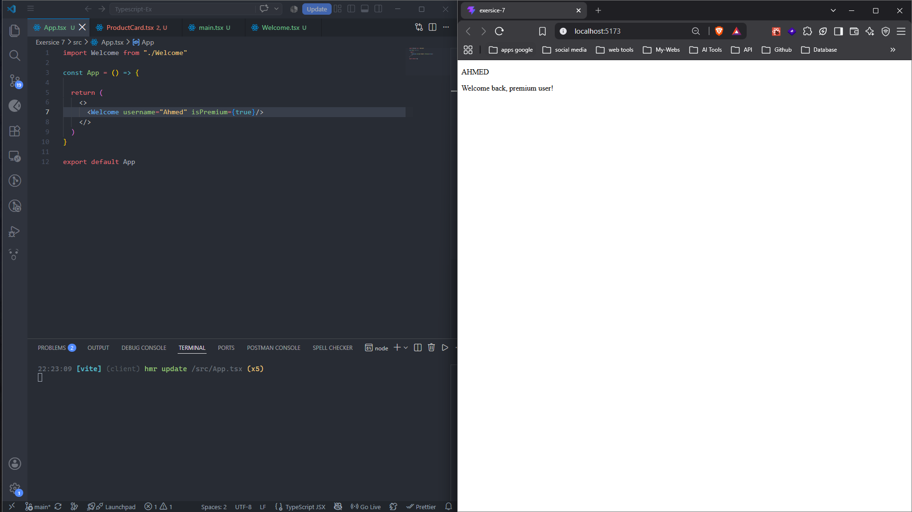
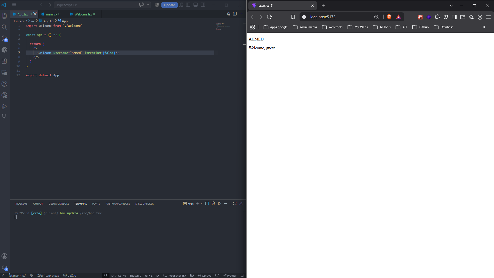
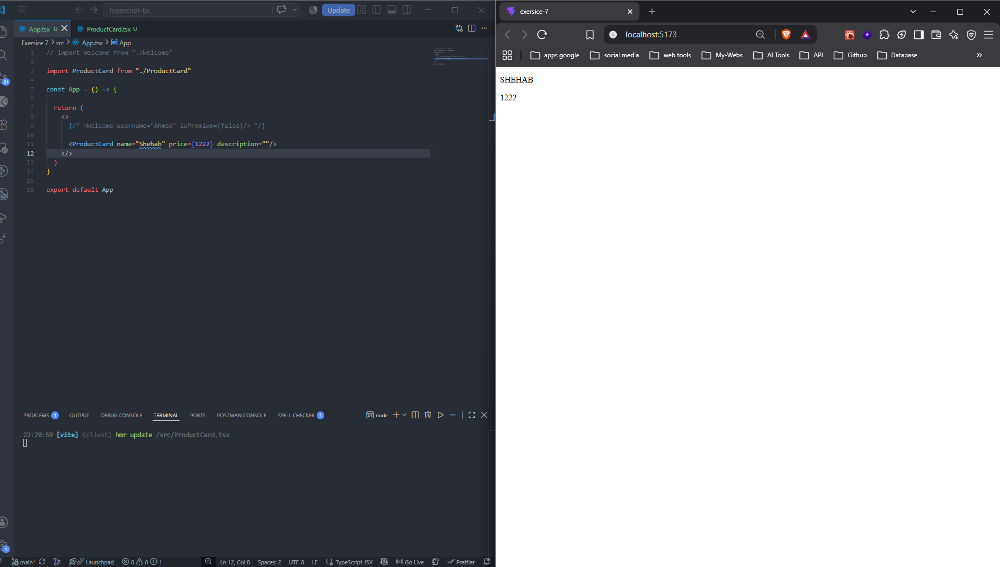
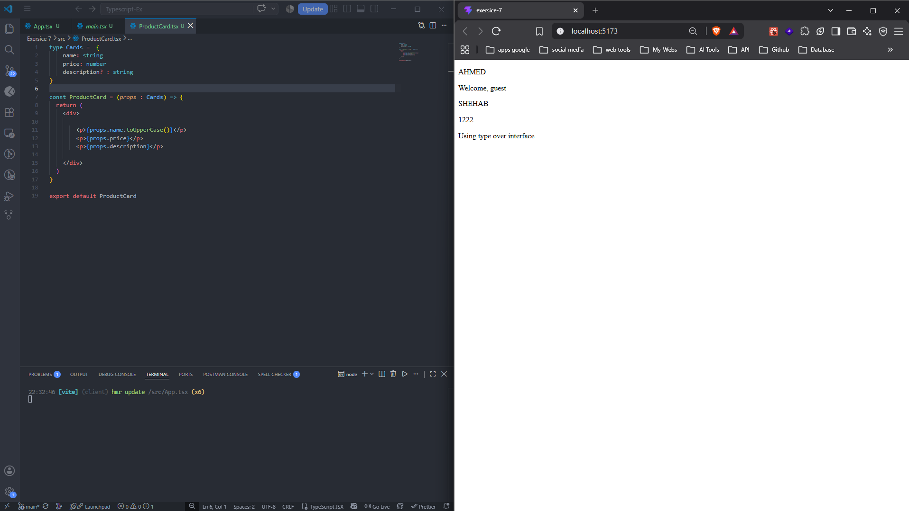
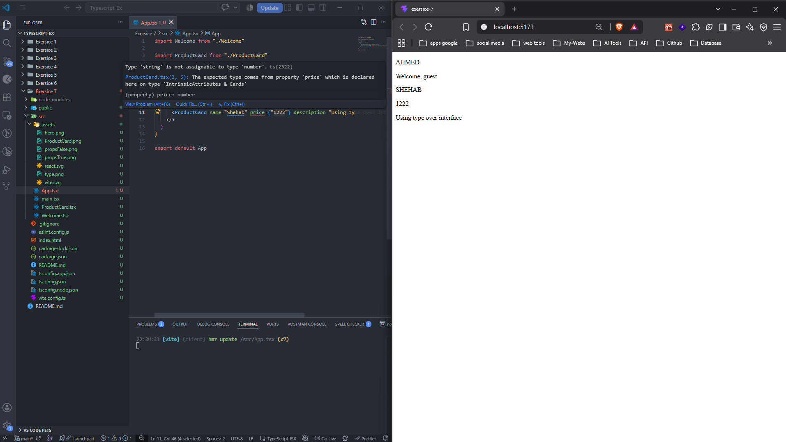

## 🏋️‍♂️ **Student Exercises**

### 1. Create a `Welcome` component

- It should accept:
    - `username: string`
    - `isPremium: boolean`
- Show a welcome message that says “Welcome back, premium user!” or “Welcome, guest”

---

### 2. Create a `ProductCard` component

- Props:
    - `name: string`
    - `price: number`
    - `description?: string`
- Display name and price; only show description if it exists

---

### 3. Use `type` instead of `interface`

- Rebuild either `Welcome` or `ProductCard` using `type` instead of `interface`

