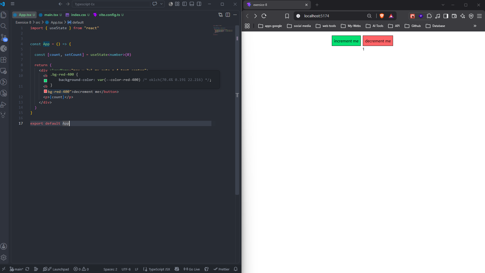
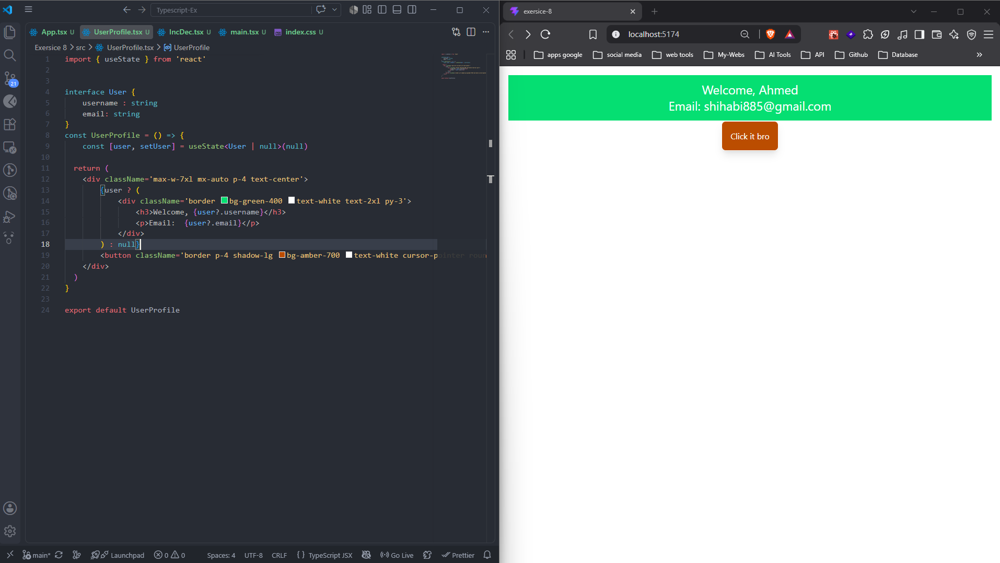
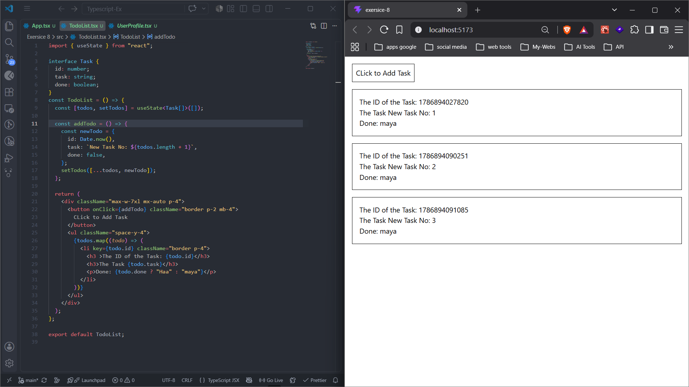
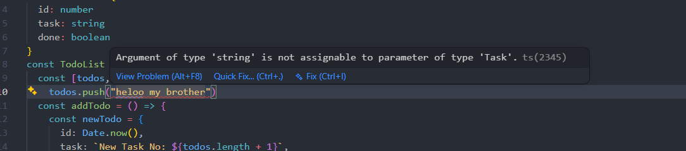
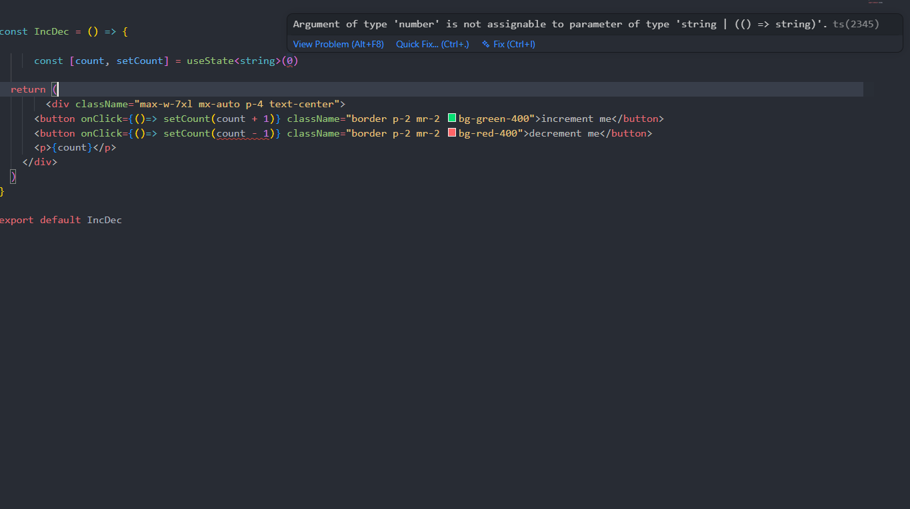
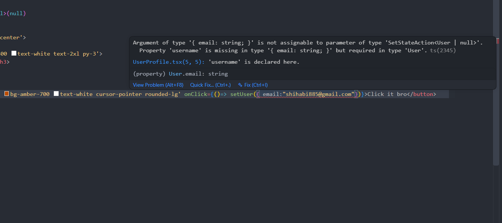

# 🏋️‍♂️ Student Exercises

## 1. 🧮 Counter
* Create a count state with useState
* Increment and decrement using buttons
* Make sure it's strictly typed as a number

## 2. 📇 User State
* Define a user object:
  * `username: string`
  * `email: string`
* Initial state: `null`
* Only render user data if it’s not null

## 3. 🧾 Todo List
* Create a Todo interface:
  * `id: number`
  * `task: string`
  * `done: boolean`
* Create state for a `Todo[]`
* Add a button that adds a new todo to the list

## 4. 💡 Optional: Break the Types
* Try to:
  * Push a string into the `Todo[]`
  * Set count to a string
  * Use `setUser` with an object missing a field
* ✅ See how TypeScript protects you!

