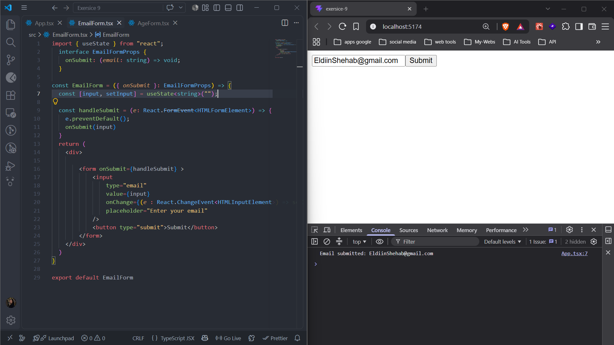
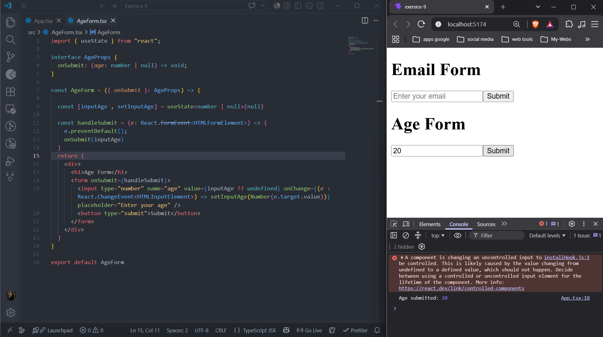
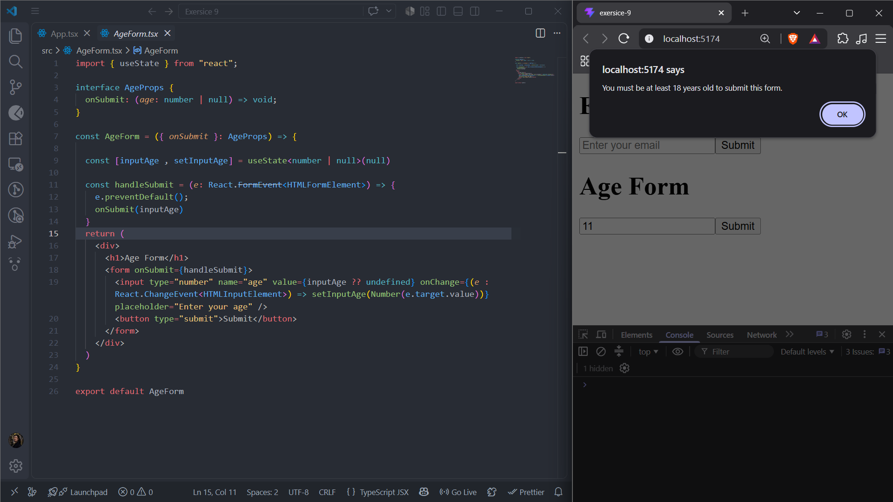
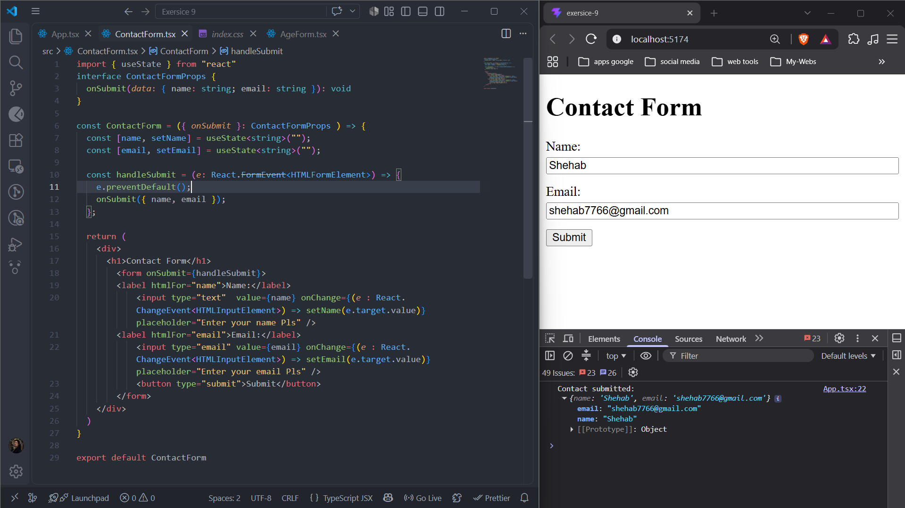
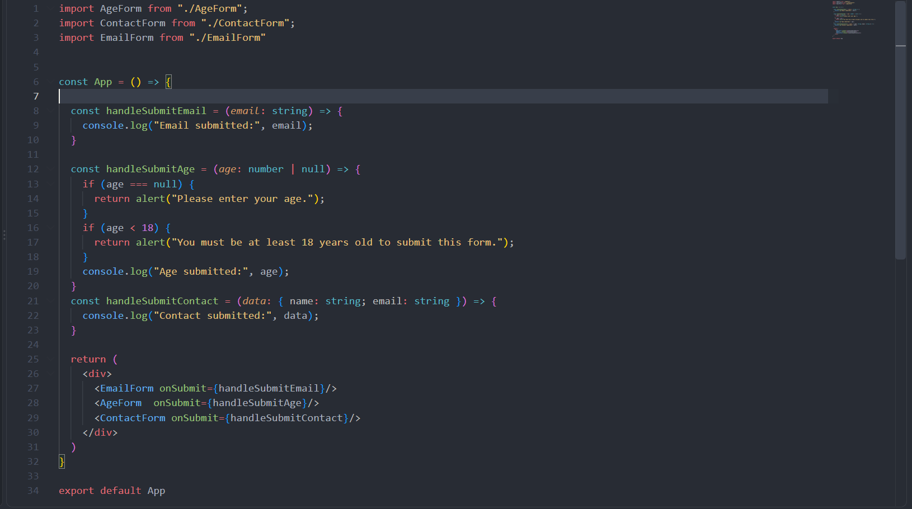

## 🏋️‍♂️ Student Exercises

### 1. ✉️ Email Form

- Create a component `EmailForm`
- Props: `onSubmit(email: string): void`
- State: `email: string`
- Call the prop on submit

---

### 2. 🔢 Age Form

- Create a component `AgeForm`
- Props: `onSubmit(age: number): void`
- State: `age: number` (parse from input string)
- Prevent submit if `age < 18`

---

### 3. 🧾 Contact Form

- Create a form with `name` and `email`
- State: `{ name: string; email: string }`
- Props: `onSubmit(data: { name: string; email: string }): void`

### App Implementation

